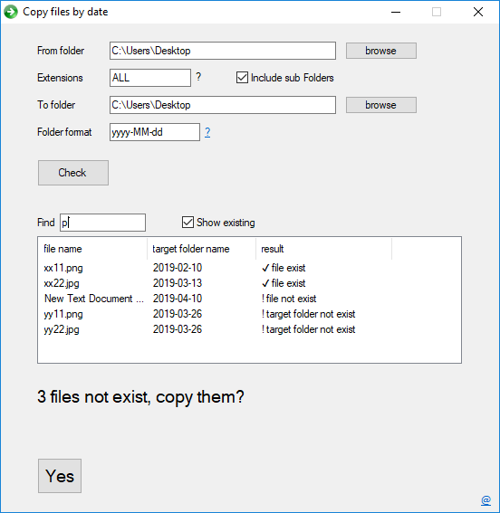

# Copy Files By Date
is initially intended to copy images from camera to computer and organize in folders by creation date.
but can also be used anywhere for copying files and organizing by folder date.
Very simple and intuitive to use.

